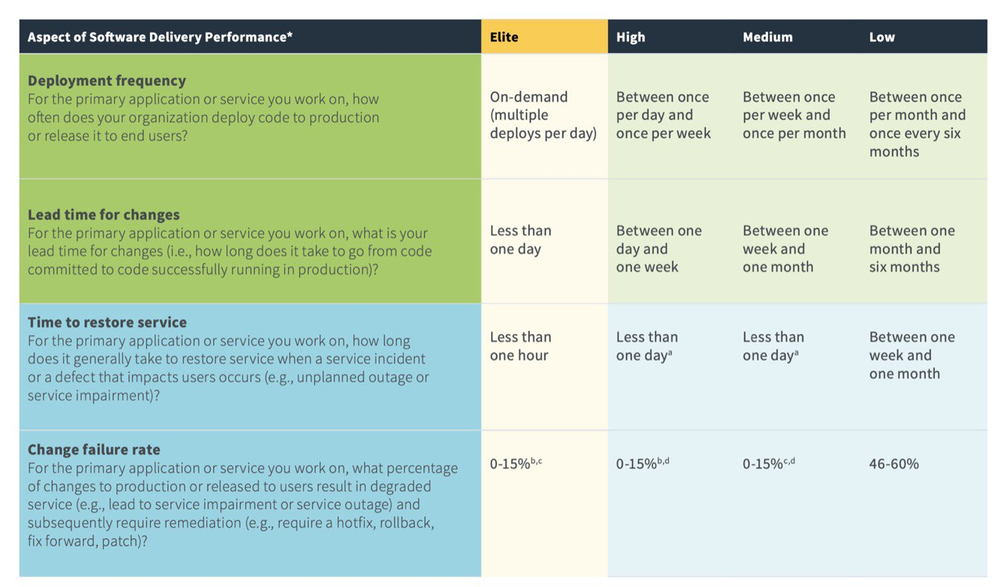

# Awesome DevOps ru

Приветствуем!  
Идея документа --- попытаться дать представление, о том, что такое DevOps через описание его самого и его сущностей. Так же, в документе, мы подбираем ссылки на полезные материалы по [часто задаваемым вопросам](#faq), аля:

* Что такое девопс? Какие проблемы решает?
* Нужен ли мне этот девопс?
* А у меня уже есть DevOps?... и другие

Эдакий Roadmap по русскоязычным ресурсам и актуальному состоянию DevOps. Хочется собрать разрозненные части воедино, в общую картинку.

Мы приглашаем вас присоединиться и присылать Pull-Requests, чтобы наполнить документ контентом. Более того, понятие “DevOps” постоянно меняется, развивается и уточняется --- давайте вместе следить за ним :)

---

## Верхнеуровневое оглавление всего документа

* [Что такое DevOps ?](#что-такое-devops)
* [Как это, DevOps ?](#как-это-devops)
* [Что мешает развитию DevOps ?](#Что-мешает-развитию-DevOps)
* [Как понять, движусь ли я к DevOps ?](#Как-понять-движусь-ли-я-к-DevOps)
* [FAQ](#faq)
* [Доп. материалы](#доп-материалы)

---

## Что такое DevOps ?

Если кратко, вольно процитируем "[Руководство по DevOps, МИФ, 2018](https://www.mann-ivanov-ferber.ru/books/rukovodstvo-po-devops/)":

> DevOps --- набор практик и культурных паттернов, которые позволяют сократить Time-to-Market и доставлять стабильный и качественный продукт клиентам.

Более развёрнутое *первое впечатление* можно получить из следующих материалов:
* Что такое DevOps / Александр Титов, DevOpsConf 2018 ([youtube](https://www.youtube.com/watch?v=php6DfXXG0Y&list=PLrFmwYyxJyVO0aU5h0KAoBIPLo6kigADb&index=4&), [habr](https://habr.com/ru/company/oleg-bunin/blog/448492/))
* Мы все DevOps / Михаил Чинков, DevOpsDays Moscow 2019

А для более глубокого понимания --- [приглашаем к дальнейшему чтению](#как-это-devops). У нас весь репозиторий пытается ответить на эти вопросы :)

### Для кого это?

> DevOps имеет смысл внедрять преимущественно **технологическим компаниям**, которые разрабатывают **цифровой продукт** и для которых **важен Time-to-Market**.

* [От сисадмина к человеку](https://www.youtube.com/watch?v=FAyTAMjcCbI), Александр Титов, DevoOps 2017

## Как это, DevOps ?

Есть как минимум две популярные инфографики на тему DevOps. А именно --- как все технические практики и культурные паттерны связываются вместе, и что и кто ещё вовлечён в процесс.

Попробуем раскрыть DevOps через них, и хоть как-то упорядочить всё вместе. Правда, есть проблема, что все называют одно и тоже разными названиями :)

1. [Cameron Haight, Getting Your Arms Around DevOps – DevOps Patterns and Practices, 2014](https://blogs.gartner.com/cameron_haight/2014/10/13/getting-your-arms-around-devops-devops-patterns-and-practices/)

2. State of DevOps, DORA

Мы намеренно взяли схему от 2018-го, так как она проще и полнее, на наш взгляд.

Итого, имеем следующее оглавление по DevOps-у:

[Technical practices](#Technical-practices)

- [Version control](#version-control)
- Infrastructure as Code
- [Automated testing](#test-automation)
- [Test data management](#test-data-management)
- [Continuous integration](#continuous-integration)
- [Trunk-based development](#trunk-based-development)
- Load testing
- [Shifting left on security](#shifting-left-on-security)
- Managing Database Changes
- [Continuous delivery](#deployment-automation)
- Continuous Deployment
- Continuous Improvement
- Continuous testing 
- Architecture
  - [Loosely coupled architecture](#Loosely-coupled-architecture)
  - [Empowering teams to choose tools](#empowering-teams-to-choose-tools)
  - Cloud native
- Availability
  - SRE
  - Chaos engineering
- Platform as a Service
- Monitoring and observability

[Lean project management and Agile practices](#Lean-project-management-and-Agile-practices)
- Team topologies
- [Team experimentation](#team-experimentation)
- Streamlining change approval
- [Customer feedback](#customer-feedback)
- Visibility of work in the value stream
- [Working in small batches](#working-in-small-batches)

[Cultural norms](#Cultural-norms)
- [Learning culture](#learning-culture)
- Collaboration among teams
- [Job satisfaction](#job-satisfaction)
- [Westrum organizational culture](#westrum-organizational-culture)

---

## Technical practices

###  Version control
Системы контроля версий, такие как Git, Subversion и Mercurial предоставляют возможность для организации файлов и контроль их создания, обновления и удаления для команд. Они плотно связаны с автоматизацией. Часто автоматизация и [continuous integration](#continuous-integration) построены на этих системах. Для улучшения доставки ПО командам необходимо использовать контроль версий для исходного кода, тестов, скриптов деплоя, конфигураций инфраструктуры и приложений. В системе контроля версий команды должны иметь возможность запрашивать текущее (и историческое) состояние своих сред. СКВ также предлагает прямые преимущества, такие как аварийное восстановление и возможность аудита  
#### материал по теме:
 - git-book https://git-scm.com/book/ru/v2

---

### Continuous integration
Программные системы сложны, и изменение в одном файле может непреднамеренно иметь последствия для всей системы. Когда много разработчиков работают над связанными системами, координация изменений в коде становится сложной проблемой и изменения от разных девелоперов могут быть несовместимы.  
  
Практика непрерывной интеграции (continuous integration, CI) была придумана, чтобы решить эти проблемы. CI следует тому принципу, что если что-то заняло много времени и энергии, то вы должны делать это чаще, чтобы это было менее болезненным в следующий раз. Создавая быструю петлю обратной связи и убеждаясь, что разработчики работают маленькими партиями, CI дает возможность командам создавать высококачественный софт, уменьшать стоимость процесса разработки и поддержки и увеличивать продуктивность команд.  
##### материал по теме:
- [en] [Мартин Фаулер о CI](https://martinfowler.com/articles/continuousIntegration.html)
---
### Deployment automation
Автоматизация деплоя - это то, что позволяет разворачивать программное обеспечение в тестовых и продуктовых средах "одним нажатием кнопки". Автоматизация необходима для снижения риска при деплое. Это также важно для обеспечения быстрой обратной связи о качестве вашего ПО, позволяя командам провести тестирование, как можно скорее после внесения изменений.
  
Автоматический деплой должен иметь следующие входные данные:
  - Артефакт, созданный системой continuous integration (CI). Это то, что можно развернуть в какой-либо среде. Это может быть Docker образ, tarball и т.д.
  - Скрипты для настройки приложения, тесты (smoke test)
  - Конфигурация окружения
  
Мы рекомендуем хранить скрипты и конфигурация в [СКВ](#version-control). Ваш процесс разворачивания должен скачать артефакт из какого-либо хранилища, например [Nexus](https://www.sonatype.com/nexus-repository-sonatype), [Artifactory](https://jfrog.com/artifactory/) или встроенный в систему CI (например [Gitlab Registry](https://docs.gitlab.com/ee/user/packages/container_registry/))
  
Процедура развертывания обычно имеет следующие шаги:
- Подготовка целевого окружения - установка и конфигурирование необходимого ПО или поднятие виртуальной машины из подготовленного образа.
- Разворачивание артефакта.
- Запуск необходимых задач, например, выполнение миграций баз данных.
- Выполнение необходимых конфигураций.
- Выполнение тестов для понимания, что все вспомогательные сервисы готовы и система функционирует корректно.
##### материал по теме:
---
### Trunk-based development
Существуют две основные схемы совместной работы команд разработчиков с использованием [системы контроля версий](#version-control). Одна из них заключается в использовании фича-бранчей (feature branch), когда разработчик или группа разработчиков создают ветку, как правило, из мастера (также известной как trunk), а затем работают изолированно в этой ветке, пока функция, которую они создают, не будет завершена. Когда команда считает, что функция готова к работе, она мерджит ветку обратно в транк.  
  
Второй шаблон известен как trunk-based development, где каждый разработчик делит свою собственную работу на небольшие партии и мерджит их в мастер, как минимум один раз (а, возможно, и несколько раз) в день. Ключевым отличием этих подходов является масштаб. В feature branches обычно участвуют несколько разработчиков, и они могут существовать дни или даже недели. А ветки в trunk-based development обычно длятся не более нескольких часов, и многие разработчики часто мерджат свои изменения в мастер.
##### материал по теме:
- [Почему Trunk Based Development — лучшая модель ветвления](https://www.youtube.com/watch?v=hIW5ynk8HWc) / Андрей Александров, DevOpsMoscow meetup 2018
- [Подход Trunk-Based Development в разработке](https://bitworks.software/2019-03-22-trunk-based-development.html)
- [Мнение: пушить сразу в мастер — хорошо. Обсуждаем Trunk Based Development](https://tproger.ru/translations/benefits-of-trunk-based-development/)
- [Оригинальный сайт с описанием методологии (англ)](https://trunkbaseddevelopment.com/)
---
### Test automation
Ключевым моментом в повышении качества кодовой базы является быстрый фидбэк о влиянии изменений. Традиционно команды использовали ручную проверку кода и ручные тесты. Эти проверки имели следующие недостатки:
- Ручное регрессионное тестирование требует много времени для выполнения, что делает его узким местом в процессе. Программное обеспечение не может выпускаться часто, и разработчики не могут получить быстрый фидбэк.
- Ручные тесты и проверки не являются надежными, потому что люди плохо справляются с повторяющимися задачами, такими как ручные регрессионные тесты, и трудно предсказать влияние изменений на сложную программную систему посредством ручной проверки.
- Для систем, которые быстро развиваются, обновление документации по тестированию требует больших усилий.  
  
Чтобы ускорить обратную связь, сообщество разработчиков предложило набор методов автоматизации тестирования еще в начале 2000-х годов. Эти методы развивались, и в настоящее время используются в конвейерах непрерывной доставки для обеспечения быстрой обратной связи с разработчиком, сокращения времени выполнения изменений, снижения частоты отказов и многого другого.
##### материал по теме:
- [Пирамида тестирования (англ)](https://martinfowler.com/articles/practical-test-pyramid.html)

---

### Loosely coupled architecture
Исследования, проведенные командой DORA (DevOps Research and Assessment), показывают, что архитектура является важным фактором, обеспечивающим непрерывную доставку. Независимо от того, используете ли вы Kubernetes или голое железо, ваша архитектура должна позволять командам внедрять практики, способствующие повышению скорости деплоя.  
  
Если команды применяют методы continuous delivery, то нижеописанные архитектурные практики могут помочь достичь следующего:
  - Команды могут вносить масштабные изменения в дизайн своих систем без разрешения кого-либо вне команды и без зависимости от других команд.
  - Команды могут выполнять работу, не нуждаясь в детальном общении и координации с людьми вне команды.
  - Команды могут деплоить и релизить свой продукт или сервис по требованию, независимо от сервисов, от которых они зависят, или сервисов, которые зависят от них.
  - Команды проводят большую часть своего тестирования как только им это нужно, не требуя интегрированной среды тестирования.
  - Команды могут развертываться в обычные рабочие часы с незначительным временем простоя.
  
Таких результатов можно достичь даже с помощью технологий мэйнфреймов. А можно не достичь их даже при использовании новейших, самых модных технологий. Многие организации тратят много времени и усилий на внедрение технологий, но не достигают необходимых результатов доставки ПО из-за ограничений, налагаемых архитектурой.
 
Когда архитектура системы позволяет командам самостоятельно тестировать, разворачивать и изменять системы вне зависимости от других команд, то они не тратят время на общение для выполнения своей работы. Другими словами, и архитектура, и команды слабо связаны.
  
Эта связь между объемом коммуникаций и архитектурой систем была впервые озвучена Мелвином Конвей (Melvin Conway), который сказал, что “организации, которые дизайнят системы… обречены создавать архитектуры, которые копируют коммуникационные структуры этих организаций”. Чтобы противодействовать тесно связанными архитектурам и помогать поддерживать более хорошие коммуникативные паттерны, команды и организации могут использовать [Inverse Conway Maneuver](https://medium.com/better-practices/how-to-dissolve-communication-barriers-in-your-api-development-organization-3347179b4ecc), где структуры команд и паттерны созданы так, чтобы достигать ожидаемое состояние архитектуры. В этом случае паттерны коммуникаций команд помогают и усиливают строящиеся архитектурные паттерны.
  
В тесно связанных монолитных архитектурах маленькие изменения могут привести к широкомасштабным каскадным падениям. Как следствие этому, каждый, кто работает над одной частью системы, должен постоянно координироваться со всеми остальными, работающими над другими частями, а также управлять сложным и бюрократическими процессами изменений. 
  
Микросервисная архитектура должна исправить эти сложности, как и любая сервис-ориентированная архитектура. На практике многие так называемые сервис-ориентированные архитектуры не позволяют тестировать и деплоить сервисы независимо друг от друга и поэтому не позволяют командам достигнуть более высокой эффективности в доставке софта. Очень важно быть нетерпимым к этим сложностям, когда вы разрабатываете сервис-ориентированную и микросервисную архитектуры.
##### материал по теме:
---
### Empowering teams to choose tools
Если вы хотите достичь более высокой эффективности в доставке софта и повысить удовлетворение от работы у своей технической команды, вы должны дать им возможность принимать осмысленное решение насчет инструментов и технологий, которые они используют в своей работе. Исследование DORA показывает, что это повышает скорость и качество CD и увеличивает эффективность доставки софта. Команды, которые могут сами выбирать инструменты, способны сделать этот выбор на основании того, как они работают и какие задачи им нужно выполнять. Никто лучше практикующих инженеров не знает, что им нужно, чтобы быть эффективными, так что это не удивительно, что выбранные этими людьми инструменты помогают получить лучшие результаты.  
  
Наличие у команд возможности выбирать инструменты не означает, что каждая команда вольна выбирать любые инструменты, которые они захотят. Внедрение технологий без ограничений может повысить технический долг и хрупкость. Тем не менее, когда вы совмещаете выбор инструмента с другими практиками например, возможностью полностью обозреть систему, быстрый фидбек и понимание того, что они сами ответственны за код, которые написали - то это помогает вашим технологам сделать мудрое решение о тех инструментах, которые они будут использовать и поддерживать. Этот паттерн был замечен в таких компаниях, как Google и Netflix, где предпочитаемый технический стек поддерживается по умолчанию. Но если команда точно чувствует, что другой инструмент для них будет лучше, они вольны выбрать его. Команды знают, что их выбор идет вместе с пониманием того, что именно они должны будут поддерживать этот новый технический стек.
##### материал по теме:
---
### Test data management
[Автоматизированное тестирование](#test-automation) является ключевым компонентом современных методов поставки программного обеспечения. Способность выполнять полный набор модульных, интеграционных и системных тестов имеет важное значение для проверки того, что ваше приложение или сервис работает должным образом и может быть безопасно развернут в промышленной среде. Чтобы убедиться, что ваши тесты проверяют реалистичные сценарии, очень важно снабжать тесты реалистичными данными.  
  
Тестовые данные важны, потому что они требуются для всех видов тестов в вашем наборе тестов, включая ручные и автоматизированные. Хорошие тестовые данные позволяют проверить распространенные или дорогостоящие кейсы пользователей, проверить на наличие краевых ситуаций, воспроизвести дефекты и смоделировать ошибки.  
  
Однако, эффективно использовать и управлять тестовыми данными сложно. Чрезмерная зависимость от данных, определенных за пределами тестов, могут сделать их хрупкими и увеличить стоимость их поддержки. Зависимости на внешние источники данных могут дать задержки и увеличить стоимость поддержки. Копирование данных с продакшна рискованно, потому что там может быть секретная информация. Чтобы устранить эти препятствия, необходима стратегия управления тестовыми данными, и нужно это делать тщательно.  
##### материал по теме:
- [Практики DevOps для администрирования баз данных (англ)](https://devopsfordba.com/)
---
### Shifting left on security
Безопасность - это всеобщая ответственность. Отчёт State of DevOps 2016 показывает, что высокопроизводительные команды тратят на 50% меньше времени на устранение проблем безопасности, чем низкопроизводительные команды. Благодаря более качественной интеграции задач информационной безопасности (InfoSec) в повседневную работу, команды могут достичь более высокого уровня производительности доставки программного обеспечения и построить более безопасные системы. Эта идея также известна как смещение влево (shift left), поскольку проблемы, включая проблемы безопасности, рассматриваются на более ранних этапах жизненного цикла разработки программного обеспечения (который на диаграммах обычно рисуется слева направо).  
  
При разработке программного обеспечения существуют, по крайней мере, следующие четыре направления деятельности: проектирование, разработка, тестирование и поставка. В традиционном цикле разработки программного обеспечения тестирование (включая тестирование безопасности) происходит после завершения разработки. Обычно это означает, что команда обнаруживает значительные проблемы, в том числе архитектурные недостатки, которые дорого исправляются.  
  
После обнаружения дефектов разработчики должны найти создающие их факторы и способы их устранения. В сложных производственных системах это, как правило, не единственная причина; напротив, зачастую это ряд факторов, которые взаимодействуют друг с другом, чтобы вызвать дефект. Дефекты, связанные с безопасностью, производительностью и доступностью, являются дорогостоящими и требуют много времени для устранения; они часто требуют архитектурных изменений. Время, необходимое для поиска дефекта, разработки решения и полной проверки исправления, непредсказуемо. Это может еще больше затянуть сроки поставки.  
  
Непрерывная поставка заключается в бережливом подходе к концепции обеспечения качества продукции на протяжении всего процесса. Как сказал Уильям Эдвардс Деминг в своих "четырнадцати пунктах трансформации менеджмента": "Уничтожайте потребность в массовых проверках и инспекции как способе достижения качества, прежде всего путем так называемого «встраивания» качества в продукцию". В этой модели вместо того, чтобы использовать чисто поэтапный подход, разработчики работают с экспертами по безопасности и тестированию, чтобы проектировать и выполнять небольшими партиями работы в течение всего жизненного цикла продукта.  
  
Исследования DevOps Research and Assessment показывают, что команды могут достичь лучших результатов, сделав безопасность частью повседневной работы каждого вместо того, чтобы тестировать безопасность по окончании процесса. Это означает интеграцию тестирования и контроля безопасности в повседневную работу по разработке, контролю качества и эксплуатации. В идеале большая часть этой работы может быть автоматизирована и внедрена в ваш пайплайн доставки. Автоматизируя эту деятельность, вы можете по требованию получить доказательства того, что ваш контроль работает эффективно; эта информация полезна для аудиторов и любых других лиц, работающих в вашем потоке создания ценности.  
##### материал по теме:

---

## Lean project management and Agile practices
### Team experimentation
Даже во многих так называемых agile-командах разработчики могут работать только с требованиями или стори (agile stories), которые к ним упали. И несмотря на знания разработчиков-специалистов или на ту информацию, которую они нашли в ходе разработки, они не могут изменить эти требования. В настоящих agile-командах то, что написано в стори-карточке - это напоминание о разговоре между пользователями и командой. Стори начинаются с бизнес цели, которую бизнес пытается достичь, или проблемы, которую хотят решить. Затем команды решают, что должно быть сделано, и проверяют, поможет ли это достичь цель или решить проблему.  

Чтобы ваша организация полностью получила пользу от современных техник разработки софта, вы должны дать возможность вашим командам экспериментировать с реальными пользователями, чтобы достичь согласованных ранее бизнес целей. В этой парадигме разработчики могут быстро прототипировать и тестировать идеи, так как они больше узнаЮт о пользователях и о проблеме, и разрабатывать решения. Затем команды внедряют то, что узнали, в дизайн продукта или сервиса. Используя практики бережливого производства (lean product management), команды доставляют фичи, которые добавляют ценность организации, и доставляют их чаще.  
Эксперименты команд - часть практик бережливого производства. Этот подход часто используется в связке с такими подходами, как  [обозреваемость работы в потоке ценности](#visibility-of-work-in-the-value-stream), [работа небольшими партиями](#working-in-small-batches) и [обозреваемость пользовательского фидбека](#customer-feedback). Эти подходы прогнозируют эффективность доставки софта и эффективность организации.
##### материал по теме:
---
### Streamlining change approval
У большинства IT-организаций есть процессы управления изменениями, чтобы контролировать жизненный цикл изменений во внутренних и внешних IT-сервисах. Эти процессы составляют главный способ уменьшения операционных рисков от изменения и рисков безопасности.  

Процессы управления изменениями часто включают в себя согласования внешними проверяющими людьми или CABы (change approval boards), чтобы провести изменение по всей системе.

Менеджеры, которые отвечают за следование внешним требованиям, и безопасники полагаются на процесс управления изменениями, чтобы, собственно, и валидировать следование требованиям, для которых обычно нужны доказательства, что все изменения нужным образом одобрены.
##### материал по теме:

---

### Customer feedback
В софтовых проектах разработчики часто работают над продуктом в течение многих месяцев и часто не проверяют, что их фичи реально помогают пользователям решить их проблемы и используются ли эти фичи вообще. 
Обратная связь от пользователей (Customer feedback) - часть более широкой группы практик, в том числе практик  [делать работу видимой](#Visibility-of-work-in-the-value-stream), [работать небольшими партиями](#Working-in-small-batches) и [Team experimentation](#Team-experimentation). Все вместе они являются частью бережливого подхода к управлению продуктом.
Совместное применение этих практик позволяет нам предсказывать:
- Производительность поставки софта, которая выражается в скорости поставки, стабильности и доступности.
- Производительность организации, которая выражается в прибыльности, доле рынка и продуктивности
  
Исследования, проведенные DORA (DevOps Research and Assessment), показывают, что команды имеют более высокую производительность, когда они работают в организациях, которые применяют эти практики, а также делают следующее:
- Регулярно собирают метрики об удовлетворенности своих клиентов.
- Собирают и учитывают фидбек от клиентов о качестве продукта и фич.
- Используют этот фидбек для разработки новых продуктов и фич. 
##### материал по теме:

---

### Visibility of work in the value stream
Возможность сделать работу видимой представляет из себя степень понимания командами потока работы от бизнеса через всю систему до клиентов и видимость себя в этом потоке, включая статус продуктов и фич. Обозреваемость работы - часть более широкой группы практик, которые входят в методы бережливого производства. Эти практики включают в себя в том числе [работу небольшими партиями](#Working-in-small-batches), [работу с пользовательским фидбеком](#Customer-feedback) и [командные эксперименты](#Team-experimentation). Эти подходы прогнозируют эффективность доставки софта и эффективность организации (которые измеряются в доле на рынке, продуктивности и рентабельности).
##### материал по теме:

---

### Working in small batches
Работа небольшими партиями - важный принцип любой дисциплины, где важны циклы обратной связи или где вы хотите быстро учиться на своих решениях. Работа небольшими партиями позволяет быстро тестировать гипотезы о том, дадут ли конкретные улучшения желаемый эффект, и если нет, то позволят скорректировать или уточнить предположения. Хотя этот раздел можно отнести к любому типу изменений, в том числе к трансформации организаций и улучшению процессов, мы здесь в основном говорим о поставке софта.  
  
Работа небольшими партиями - это часть бережливого управления продуктом. Вместе с такими практиками как [делать работу видимой](#Visibility-of-work-in-the-value-stream), [Team experimentation](#Team-experimentation) и [обратная связь с пользователями](#customer-feedback)  работа небольшими партиями говорит как о производительности поставки софта, так и производительности организации. 
  
Одна из причин того, что команды часто работают большими партиями в том, что [согласование изменений](#Streamlining-change-approval) дорого. В традиционных поэтапных подходах к разработке софта из разработки в тестирование или из тестирования в деплой обычно передают целые релизы: месяцы работы команд, состоящих из десятков и сотен людей. В таком традиционном подходе согласование выкатываемого изменения может занимать недели и месяцы. 

В противоположность этому практики DevOps используют для этого кроссфункциональные команды и легковесные подходы, и это позволяет передавать софт из разработки через тестирование и деплой в продакшн в течение всего лишь минут. Конечно, для этого требуется работать с небольшими партиями кода.
У работы небольшими партиями много преимуществ:
- Это уменьшает время получения фидбека от изменения, что упрощает определение причин новых ошибок и их устранение
- Это ускоряет эффективность и мотивацию
- Это не дает попасть в ловушку невозвратных затрат (sunk-cost fallacy)
  
Работать небольшими партиями можно как на уровни фичи, так и на уровне продукта. В качестве примера можно привести подход MVP, минимально жизнеспособный продукт - прототип продукта с минимальным количеством фич, которые нам позволят протестировать продукт и его бизнес-модель.

Continuous delivery основана на работе небольшими партиями и пытается применить любое изменение из системы контроля версий как можно раньше. Цель continuous delivery - поменять экономику поставки софта и сделать доступной работу небольшими партиями. Этот подход дает командам быстрый и полный фидбек и позволяет им улучшать свои рабочие процессы.
##### материал по теме:
- Принципы потока разработки продуктов: https://sdu2020.blogspot.com/2018/10/01.html

---

## Cultural norms

### Job satisfaction
Ранние исследования, проведенные DevOps Research and Assessment (DORA), показали, что удовлетворенность работой является важным фактором, предопределяющим эффективность работы организации. Вовлеченность сотрудников, выполняющих осмысленную работу, повышает ценность бизнеса.

Все знают, что такое удовлетворенность работой. Речь идет о выполнении работы, которая является сложной и значимой для бизнеса, а также о том, чтобы получить возможность применять свои навыки и самостоятельно принимать решения. Там, где есть удовлетворенность работой, сотрудники приносят на работу все лучшее, что в них есть: их вовлеченность, творчество и мышление. В результате появляется больше инноваций в любой сфере бизнеса, в том числе в области технологий.  

Когда речь заходит о преимуществах удовлетворенности работой, возникает круг позитивной обратной связи. Люди лучше выполняют свою работу, когда чувствуют поддержку работодателей, когда у них есть инструменты и ресурсы для выполнения своей работы и когда они чувствуют, что их решения ценятся. Улучшение работы приводит к повышению производительности при поставке программного обеспечения, что приводит к повышению эффективности работы организации.  

Этот цикл непрерывного совершенствования и обучения отличает успешные компании, позволяя им внедрять инновации, опережать конкурентов и побеждать.  
##### материал по теме:

---

### Westrum organizational culture
в стадии наполнения

---

### Learning culture
Исследование от команды DORA показывает, что любая организационная культура, которая ценит обучение, влияет на эффективность доставки софта следующими вещами:
повышением частоты деплоев сокращением времени для изменений, для восстановления сервиса и сокращением количества падений после изменений сильной командной культурой. Атмосфера обучения в вашей организации напрямую зависит от степени, с которой ваша организация относится к обучению, как к стратегии:
- Видит ли ваша организация обучение как инвестицию в необходимый рост?
- Обучение видится как необходимое зло, неохотно принимаемое во внимание?
- Обучение полностью избегается?  
  
Исследование, проведенное в других областях, например, в бухгалтерском деле, также показало, что атмосфера, поощряющая обучение, прогнозируемо повышает эффективность.

##### материал по теме:

---

## Что мешает развитию DevOps ?

* [Закон Конвея](https://ru.wikipedia.org/wiki/%D0%97%D0%B0%D0%BA%D0%BE%D0%BD_%D0%9A%D0%BE%D0%BD%D0%B2%D0%B5%D1%8F). Текущий уклад коммуникаций в компании между командами очень ограничивает проектирование и построение *новых систем*, способных приводить к *новым результатам*.
* Колодцы (silo) между командами. Выстроенные жёсткие границы в общении.
* Аутсорсинг. Внешняя команда разработки и/или эксплуатации
* Лень людей узнавать новое и расти "вширь", в Т-shape специалистов
* Отсутствие у команд/подразделений общей карты взаимодействия друг с другом
* Технический долг

## Как понять, движусь ли я к DevOps ?

### Через вопросы

Вы можете самостоятельно понять, движетесь ли вы к DevOps-культуре, ответив на следующие вопросы:

* Есть ли у вас стратегия по созданию цифрового продукта?
* Пользуются ли команды общими инструментами, вносят ли вклад в изменения этих общих инструментов?
* Насколько часто команды переформируются — одни специалисты из одной команды переходят в другую команду?
* Можно ли создать комитет по изменению и что-то изменить?

---

* Есть ли у вас в команде/компании общий инфраструктурный репозиторий?
* Контролируете ли вы технический долг в инфраструктуре?
* Используете ли вы практики разработки в инфраструктурном репозитории?
* Нарезана ли ваша инфраструктура на слои? Можно свериться, например, со схемой Base-service-APP. Насколько сложно внести изменение?

---

* Время от описания фичи до выкатки в продакшен в 95 % случаев меньше недели? 
* Повышается ли качество артефакта на каждом этапе пайплайна?
* Используете ли вы различные стратегии деплоя?

---

* Ваш мониторинг и логирование — это средство разработки для вас? Ваши разработчики, и вы в том числе, когда пишут код, думают о том, как его замониторить?
* Узнаете ли вы о проблемах от клиентов? Понимаете ли вы клиента лучше из мониторинга и логирования? Понимаете ли вы систему лучше из мониторинга и логирования?
* Меняете ли вы систему просто потому, что увидели, что тренд в системе растет и понимаете, что еще 3 недели и все загнется?

---

* Выделена ли инфраструктурная платформа? Кто отвечает за ее развитие? Понимаете ли вы конкурентные преимущества своей инфраструктурной платформы?

Эти вопросы надо постоянно себе задавать. Если что-то можно вынести на сторонние сервисы — нужно выносить, если сторонний сервис начинает блокировать ваше движение, то надо строить систему внутри себя.

### Через метрики

Также, вы можете оценить свою команду/компанию по [четырём общепринятым метрикам](https://stelligent.com/2018/12/21/measuring-devops-success-with-four-key-metrics/ "en"):

* Deployment Frequency
* Lead time for changes
* Time to restore service
* Change failure rate

## FAQ

**Мифы о DevOps?**
* Мифы про DevOps. RootConf 2017 - https://habr.com/ru/company/oleg-bunin/blog/358480/ 

**Что такое цифровой продукт?**
* Цифровой продукт, Виталий Хабаров. DevOpsDays Moscow 2019

**В чем разница DevOps и SRE?**
* https://www.youtube.com/watch?v=e5CQjAEwPJE

**А есть примеры трансформаций у больших/энтерпрайз компаний?**
* «Девопс трансформация Альфа-Банка», Антон Исанин. DevOpsDays Moscow 2018 / https://www.youtube.com/watch?v=oyrzLfu7ZPE&list=PL7zoudiRHpqXiyjrUhFxu6KTMC5I8tHEm&index=8 
* https://devopsconf.io/moscow/2018/abstracts/3962 Альфа DevOpsCOnf 2018
* Трансформация РайфазенБанк. «DevOps в большой организации: в новый век за 1 год». DevOpsDays Moscow 2017 / https://www.youtube.com/watch?v=NVWCpZCCIq4&list=PL7zoudiRHpqVpASHAkCeTPkNjB6-XmXS3 
* Колёса: https://devopsconf.io/moscow/2018/abstracts/3991 
* Росбанк, 1000 дней девопса в кровавом энтерпрайзе. DevOpsDays Moscow 2019

**Могу ли я нанять DevOps-инженера, чтобы было норм?**
TL; DR: нет :(  

* «Как перестать быть DevOps инженером», Сергей Егоров. DevOpsDays Moscow 2017 / https://www.youtube.com/watch?v=iqJjyNXhuOY&list=PL7zoudiRHpqVpASHAkCeTPkNjB6-XmXS3&index=23&t=0s
* «Чем DevOps НЕ является», Леон Файер. DevOpsDays Moscow 2017 / https://www.youtube.com/watch?v=yC0ScJ3Orzc&list=PL7zoudiRHpqVpASHAkCeTPkNjB6-XmXS3

**Как мне себя называть, если devops-инженера "не существует" ?**
* Если для поиска работы - то devops-инженером или SRE или инженером платформы, билд\релиз-инженером ;D

**Как мне настроить сканирование Docker-образов в pipeline?**
* Выступление rus dacent на sre-spb. Ждём слайдов

**Какие минимальные метрики приложения (20%) мне помогут легче жить (80%)?**
* Статья про RED / USE метрики

**Как продать DevOps наверх/командам ?**
* «Круглый стол - Как "продать" DevOps коллегам, начальству и прочим равнодушным», DevoOps 2017 / https://www.youtube.com/watch?v=ZWyjxjDeUvg

**Как мне начать DevOps трансформацию внутри команды?**
* https://habr.com/ru/company/oleg-bunin/blog/448490/ 

**Что почитать?**
* DevOps Handbook
* Проект Феникс
* Accelerate
* [Google SRE books](https://landing.google.com/sre/books/ )
* State of DevOps 2017
* State of DevOps 2018
* State of DevOps 2019

**Что почитать именно из книг, чтобы фундаментально и полезно?**
* Книги, которые сделали нас лучше http://hangops.ru/knighi-kotoryie-sdielali-nas-luchshie/

**Как мне правильно спроектировать архитектуру под большие данные?**
* Designing Data-Intensive Applications /  https://www.amazon.com/Designing-Data-Intensive-Applications-Reliable-Maintainable/dp/1449373321

