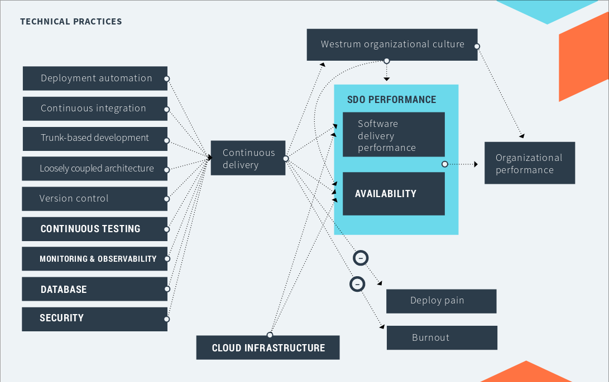

# Awesome devops ru
- [Введение]()
- [Что такое DevOps]()
- [Что он решает]()
- [Capabilities DevOps]()
  - [Техники]()
    - [Version control]()
    - [Continuous integration]()
    - [Deployment automation]()
    - [Trunk-based development]()
    - [Test automation]()
    - [Architecture]()
    - [Empowering teams to choose tools]()
    - [Test data management]()
    - [Shifting left on security]()
  - [Процессы]()
    - [Team experimentation]()
    - [Streamlining change approval]()
    - [Customer feedback]()
    - [Visibility of work in the value stream]()
    - [Working in small batches]()
  - [Измерения]()
    - [Monitoring systems to inform business decisions]()
    - [Proactive failure notification]()
    - [Work in process limits]()
    - [Visual management capabilities]()
  - [Культура]()
    - [Job satisfaction]()
    - [Westrum organizational culture]()
    - [Learning culture]()
- [ЧаВо]()
- [Доп. материалы]()

## Вводная про этот репозиторий

## DevOps (Что такое DevOps)
DevOps is an organizational and cultural movement that aims to increase software delivery velocity, improve service reliability, and build shared ownership among software stakeholders. Learn how to improve the speed, stability, availability, and security of your software delivery capability.

## DevOps capabilities (Что он решает)
Improve your performance and become a high performer by improving capabilities shown to drive performance improvements. DevOps Research and Assessment (DORA’s) six-year research program has validated a number of technical, process, measurement, and cultural capabilities to drive higher software delivery and organizational performance. Below, you’ll find links to articles on these capabilities, how to implement them, and how to overcome common obstacles.

### Техники
####  Version control
##### Описание
Системы контроля версий, такие как Git, Subversion, и Mercurial предоставляют системы для организации файлов и координировании их создания, обновления и удаления для команд. Эти системы плотно связаны с автоматизацией. Часто, автоматизация и continuous integration построены на этих системах. Для улучшения доставки ПО командам необходимо использовать контроль версий для исходного кода, тестов, скриптов деплоя, конфигураций инстраструктуры и приложений. В системе контроля версий коммманды должны иметь возможность запрашивать текущее (и историческое) состояние своих сред. СКВ также предлагает прямые преимущества, такие как аварийное восстановление и возможность аудита  
##### Материал
    - git-book https://git-scm.com/book/ru/v2
---
#### Continuous integration
##### Описание
Software systems are complex, and an apparently simple, self-contained change to a single file can have unintended side effects on the overall system. When a large number of developers work on related systems, coordinating code updates is a hard problem, and changes from different developers can be incompatible.  
  
The practice of continuous integration (CI) was created to address these problems. CI follows the principle that if something takes a lot of time and energy, you should do it more often, forcing you to make it less painful. By creating rapid feedback loops and ensuring that developers work in small batches, CI enables teams to produce high quality software, to reduce the cost of ongoing software development and maintenance, and to increase the productivity of the teams.

##### Материал
#### Deployment automation
##### Описание
Deployment automation is what enables you to deploy your software to testing and production environments with the push of a button. Automation is essential to reduce the risk of production deployments. It's also essential for providing fast feedback on the quality of your software by allowing teams to do comprehensive testing as soon as possible after changes.  
  
An automated deployment process has the following inputs:  
  
  - Packages created by the continuous integration (CI) process (these packages should be deployable to any environment, including production).
  - Scripts to configure the environment, deploy the packages, and perform a deployment test (sometimes known as a smoke test).
  - Environment-specific configuration information.
  
We recommend that you store the scripts and configuration information in [version contro](version-controll)l. Your deployment process should download the packages from an artifact repository (for example, Container Registry, Nexus, Artifactory, or your CI tool's built-in repository).  

The scripts usually perform the following tasks:

  - Prepare the target environment, perhaps by installing and configuring any necessary software, or by starting up a virtual host from a pre-prepared image in a cloud provider.
  - Deploy the packages.
  - Perform any deployment-related tasks such as running database migration scripts.
  - Perform any required configuration.
  - Perform a deployment test to make sure that any necessary external services are reachable, and that the system is functioning.

##### Материал
#### Trunk-based development
##### Описание
  There are two main patterns for developer teams to work together using version control. One is to use feature branches, where either a developer or a group of developers create a branch usually from trunk (also known as master or mainline) and then work in isolation on that branch until the feature they are building is complete. When the team considers the feature ready to go, they merge the feature branch back to trunk.  
  
The second pattern is known as trunk-based development, where each developer divides their own work into small batches and merges that work into trunk at least once (and potentially several times) a day. The key difference between these approaches is scope. Feature branches typically involve multiple developers and take days or even weeks of work. In contrast, branches in trunk-based development typically last no more than a few hours, with many developers merging their individual changes into trunk frequently.
##### Материал
#### Test automation
##### Описание
The key to building quality into software is getting fast feedback on the impact of changes. Traditionally, teams used manual code inspection and testing to verify systems' correctness. These inspections and tests occurred after "dev complete," and had the following drawbacks:
  - Manual regression testing is time-consuming to execute and expensive to perform, which makes it a bottleneck in the process. Software can't be released frequently and developers can't get quick feedback.
  - Manual tests and inspections are not reliable, because people are poor at repetitive tasks like manual regression tests, and it is hard to predict the impact of changes on a complex software system through inspection.
  - For systems that evolve over time, keeping test documentation up to date requires a considerable effort.  
To speed up feedback, the agile development community proposed a set of test automation techniques in the early 2000s. These techniques evolved and are now used in continuous delivery pipelines to provide quick developer feedback, reduce lead time for changes, reduce failure rate, and more.
##### Материал
#### Architecture
##### Описание
Research from the DevOps Research and Assessment (DORA) team shows that architecture is an important predictor for achieving continuous delivery. Whether you're using Kubernetes or mainframes, your architecture enables teams to adopt practices that foster higher levels of software delivery performance.  
  
When teams adopt continuous delivery practices, adopting the following architectural practices drives successful outcomes:
  - Teams can make large-scale changes to the design of their systems without the permission of somebody outside the team or depending on other teams.
  - Teams are able to complete work without needing fine-grained communication and coordination with people outside the team.
  - Teams deploy and release their product or service on demand, independently of the services it depends on or of other services that depend on it.
  - Teams do most of their testing on demand, without requiring an integrated test environment.
  - Teams can deploy during normal business hours with negligible downtime.  

It's possible to achieve these outcomes with mainframe technologies. It's also possible to fail to achieve them even when using the latest, most trendy technologies. Many organizations invest lots of time and effort in adopting technologies, but fail to achieve critical software delivery outcomes, due to limitations imposed by architecture.  
  
When the architecture of the system is designed to enable teams to test, deploy, and change systems without dependencies on other teams, teams require little communication to get work done. In other words, both the architecture and the teams are loosely coupled.  
  
This connection between communication bandwidth and systems architecture was first discussed by Melvin Conway, who said, "organizations which design systems ... are constrained to produce designs which are copies of the communication structures of these organizations." To counteract tightly-coupled architectures and help support better communication patterns, teams and organizations can use the [Inverse Conway Maneuver](https://medium.com/better-practices/how-to-dissolve-communication-barriers-in-your-api-development-organization-3347179b4ecc), whereby team structures and patterns are designed to promote the expected architectural state. In this way, team communication patterns support and enforce the architectural patterns that are built.  
  
With a tightly coupled architecture, small changes can result in large-scale, cascading failures. As a result, anyone working in one part of the system must constantly coordinate with anyone else working in another part of the system, including navigating complex and bureaucratic change management processes.  
  
Microservices architectures are supposed to enable these outcomes, as should any true service-oriented architecture. In practice, many so-called service-oriented architectures don't permit testing and deploying services independently of each other, and thus won’t let teams achieve higher software delivery performance. It's essential to be strict about these outcomes when implementing service-oriented and microservice architectures.
##### Материал
#### Empowering teams to choose tools
##### Описание
##### Материал
#### Test data management
##### Описание
##### Материал
#### Shifting left on security
##### Описание
##### Материал
---
### Процессы
#### Team experimentation
##### Описание
##### Материал
#### Streamlining change approval
##### Описание
##### Материал
#### Customer feedback
##### Описание
##### Материал
#### Visibility of work in the value stream
##### Описание
##### Материал
#### Working in small batches
##### Описание
##### Материал
---
### Измерения
#### Monitoring systems to inform business decisions
##### Описание
##### Материал
#### Proactive failure notification
##### Описание
##### Материал
#### Work in process limits
##### Описание
##### Материал
#### Visual management capabilities
##### Описание
##### Материал
---
### Культура
#### Job satisfaction
##### Описание
##### Материал
#### Westrum organizational culture
##### Описание
##### Материал
#### Learning culture
##### Описание
##### Материал
---
### Часто задаваемые вопросы
### Доп. материалы
(Материал ненашедший себе места в вышеописанных статьях)
